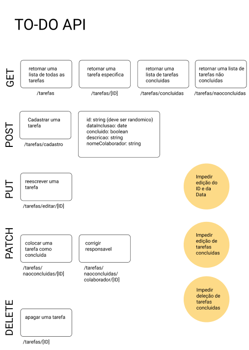

# TO DO API

Projeto CRUD de lista de tarefas.

O projeto é destinado a criar uma API para lista de tarefas, utilizando boas práticas e estrutura de pastas seguindo o design MVC.

## Motivação

Aplicar os conceitos de GET, POST, PATCH e DELETE, integrantes dos métodos HTTP.

## Ferramentas utilizadas

- Nodejs
- Expressjs
- Nodemon

